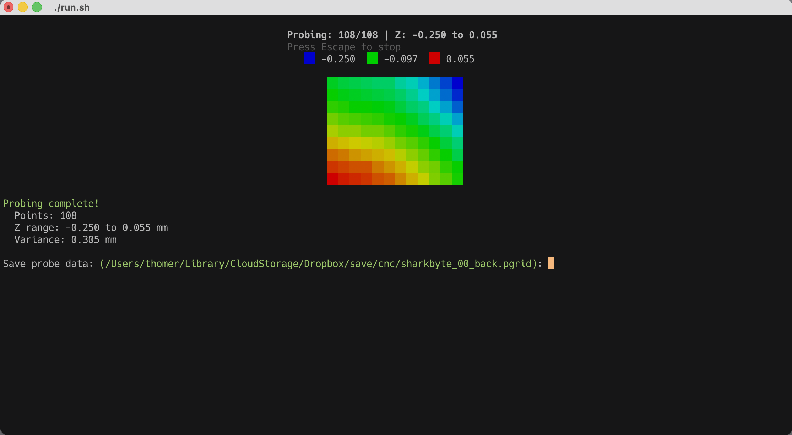
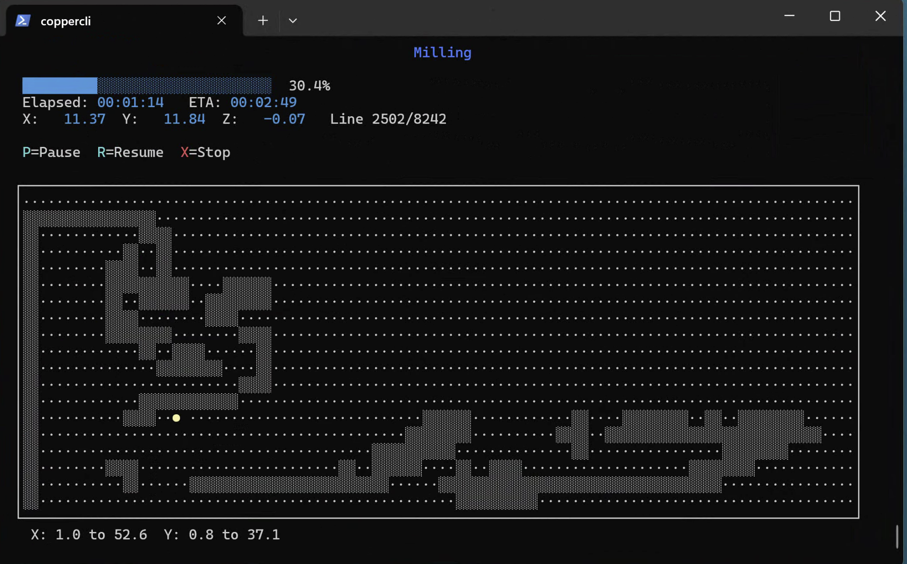
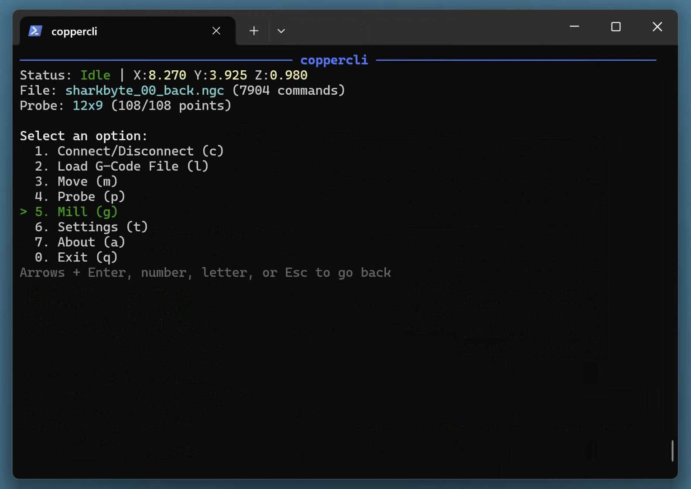
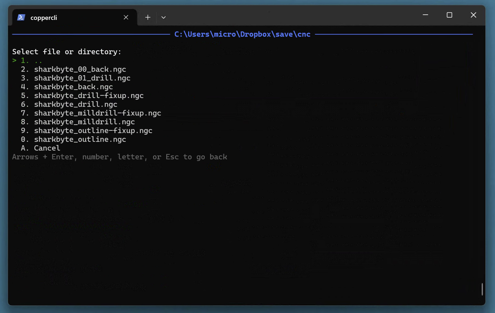
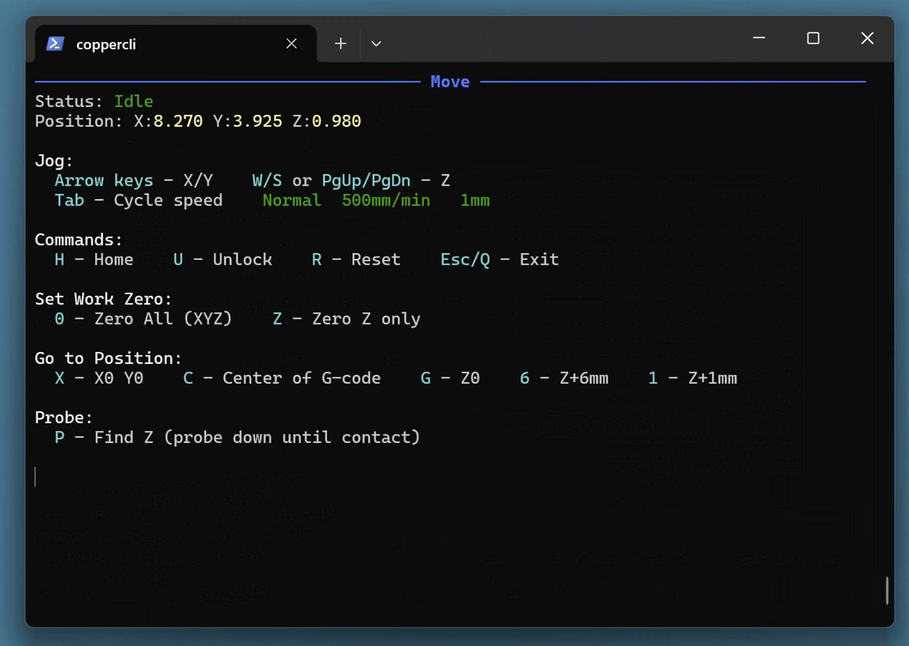
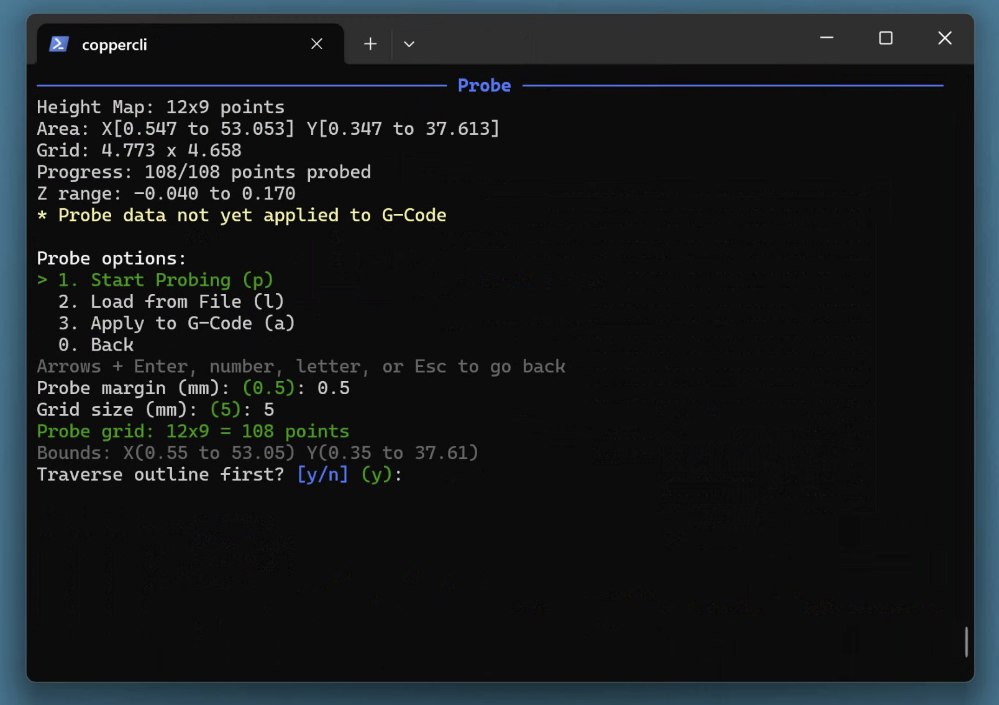
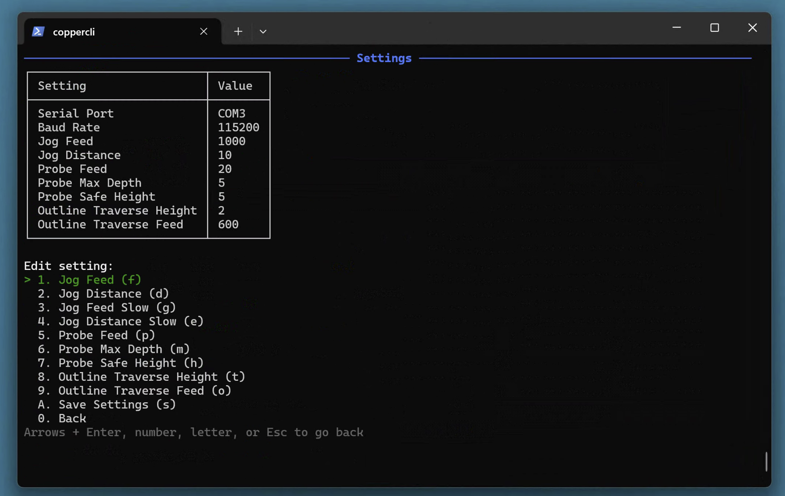

#  coppercli

A platform-agnostic CLI tool for PCB milling with GRBL CNC machines, featuring auto-leveling via probe grids. Originally based on [OpenCNCPilot](https://github.com/martin2250/OpenCNCPilot).

| Probing | Milling |
|:-------:|:-------:|
|  |  |

## Install

[](https://github.com/thomergil/coppercli/releases/latest)
[](https://github.com/thomergil/homebrew-coppercli)
[](https://github.com/thomergil/coppercli/releases/latest)

| Platform | Install |
|----------|---------|
| **Windows** | Download and run installer from [Releases](https://github.com/thomergil/coppercli/releases/latest) |
| **macOS** | `brew tap thomergil/coppercli && brew install coppercli` |
| **Linux** | Download tarball from [Releases](https://github.com/thomergil/coppercli/releases/latest), extract, run `./coppercli` |
| **From source** | Clone repo, then `./run.sh` (macOS/Linux) or `run.bat` (Windows) |

Requires [.NET 8 SDK](https://dotnet.microsoft.com/download/dotnet/8.0) for running from source.

## Screenshots

| Main Menu | File Browser | Jog | Probe Setup |
|-----------|--------------|----------|-------------|
|  |  |  |  |

| Probing                                 | Milling                                        | Settings                                      | Milled PCB                                 |
| --------------------------------------- | ---------------------------------------------- | --------------------------------------------- | ------------------------------------------ |
|  |  |  |  |

## Background

This project is based on [OpenCNCPilot](https://github.com/martin2250/OpenCNCPilot) by [martin2250](https://github.com/martin2250), which is an excellent tool for CNC machine control and PCB auto-leveling. OpenCNCPilot has solid core functionality for G-code parsing, height map interpolation, and GRBL communication.

However, OpenCNCPilot has some limitations:

- **Windows-only**: Built with WPF, it only runs on Windows
- **GUI-heavy workflow**: The interface requires a lot of mouse clicking and navigating through dialogs, which can be cumbersome when you're standing at a CNC machine with greasy hands
- **No session persistence**: If you disconnect or the program crashes mid-probe, you lose your progress and have to start over

coppercli addresses these issues by providing a keyboard-driven CLI that runs on Linux, macOS, and Windows, with robust session recovery.

## A Note on Development

C#/.NET is by no means my language of choice, but I wanted to leverage the excellent core functionality in OpenCNCPilot rather than rewrite G-code parsing and height map interpolation from scratch. I worked with [Claude Code](https://claude.ai/claude-code) to rework the codebase into this CLI version.

## Features

### Platform Agnostic
- Runs on Linux, macOS, and Windows
- .NET 8 runtime (cross-platform)
- Serial and Ethernet connections supported
- Auto-detect serial port and baud rate (cycles through common rates to find GRBL devices)

### Keyboard-Driven Interface
- Single-key navigation throughout
- Arrow keys for jogging, Tab to cycle speeds
- Number keys and mnemonics for menu selection
- Smart menu defaults: automatically highlights the most logical next step (Connect → Load → Move → Probe → Mill)
- Built-in file browser for G-code and probe grid files (remembers last directory)
- No mouse required

### Probing Features
- **Probe grid auto-leveling**: Compensates for PCB surface irregularities
- **Outline traversal**: Before probing, traverse the outer boundary of the probe area to check for collisions or clearance issues
- **Configurable probe parameters**: Safe height, max depth, feed rate, grid size
- **Save/load probe grids**: Reuse probe data across sessions (.pgrid files)

### Session Persistence

- **Continue where you left off**: Interrupted probing sessions are auto-saved and can be resumed
- **Remembers your last file**: Offers to reload the last G-code file on startup
- **Trusts stored work zero**: Option to accept GRBL's stored work coordinate system from a previous session

### Machine Control

- Real-time position display
- Multiple jog speed presets (Tab to cycle: Fast/Normal/Slow/Creep)
- Pause/Resume/Emergency Stop during milling (P/R/X keys) with automatic spindle shutdown and Z retraction
- Home, unlock, and soft reset commands
- Set work zero (all axes or Z-only)
- Quick positioning (go to X0Y0, Z0, Z+6mm, Z+1mm)
- Single Z probe (find Z height at current XY position)
- Move to center of loaded G-code file

### G-Code Handling
- Load and preview G-code files
- View file bounds and estimated run time
- Apply height map compensation
- Run with real-time progress display
- 2D position grid visualization during milling (shows spindle position, visited/unvisited areas)
- Terminal resize detection with auto-redraw

## Usage

```bash
./run.sh        # macOS/Linux
run.bat         # Windows
```

## Configuration

Two JSON files are stored in the working directory (both managed by coppercli):

**`settings.json`** - User preferences:
- **Connection**: Serial port, baud rate, ethernet IP/port
- **Jogging**: Feed rates and distances for normal/slow modes
- **Probing**: Safe height, max depth, feed rate, grid size
- **Outline traversal**: Height and feed rate for boundary check

**`session.json`** - Session state (auto-managed):
- Last loaded G-code file path
- Last file browser directory
- Interrupted probe session data for recovery

## File Formats

- **G-code**: `.nc`, `.gcode`, `.ngc`, `.gc`, `.tap`, `.cnc`
- **Probe grids**: `.pgrid` (XML format, compatible with OpenCNCPilot's `.hmap`)

## Warning

**This software is EXTREMELY EXPERIMENTAL and may damage your CNC machine. Use at your own risk.**

Always:
- Start with the spindle off when testing
- Use the outline traversal feature to check clearance before probing
- Keep your hand on the emergency stop
- Verify probe data looks reasonable before running G-code

## Tutorial

For a complete end-to-end guide on milling PCBs—from KiCad export through G-code generation to probing and milling—see [Milling a PCB with auto-leveling using a Carbide 3D Nomad 3](https://github.com/thomergil/pcb-nomad3).

## License

MIT License - see [LICENSE](LICENSE)

## Acknowledgments

- [OpenCNCPilot](https://github.com/martin2250/OpenCNCPilot) by [martin2250](https://github.com/martin2250) - the foundation this project is built on
- [Spectre.Console](https://spectreconsole.net/) - console UI library
- [Claude Code](https://claude.ai/claude-code) - AI pair programming assistant
