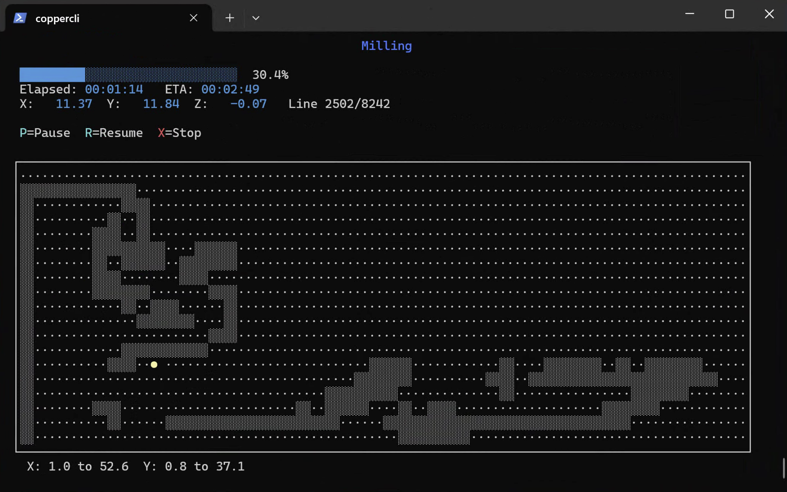
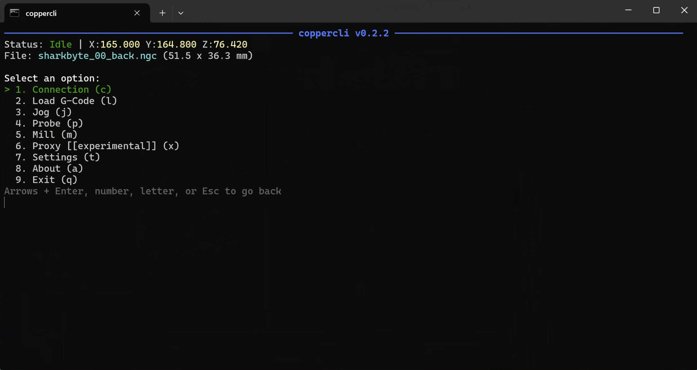
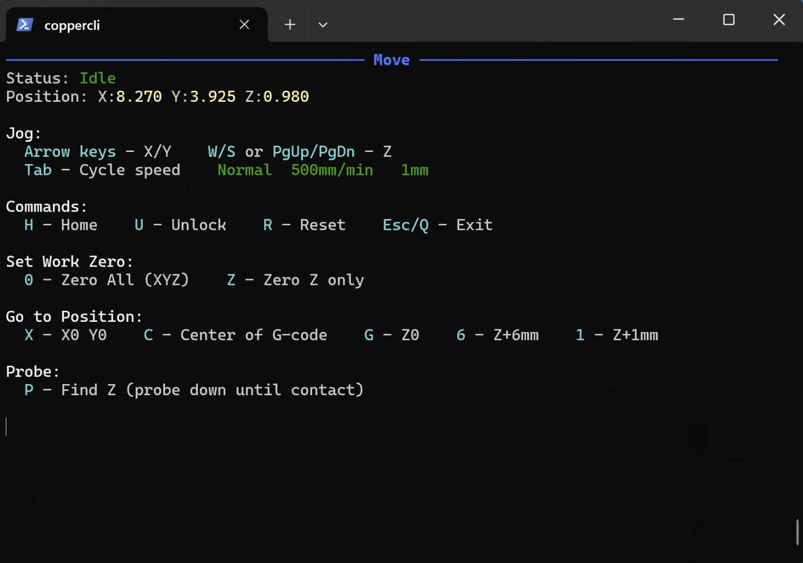
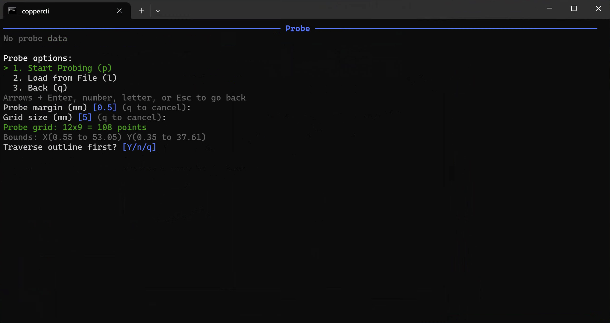
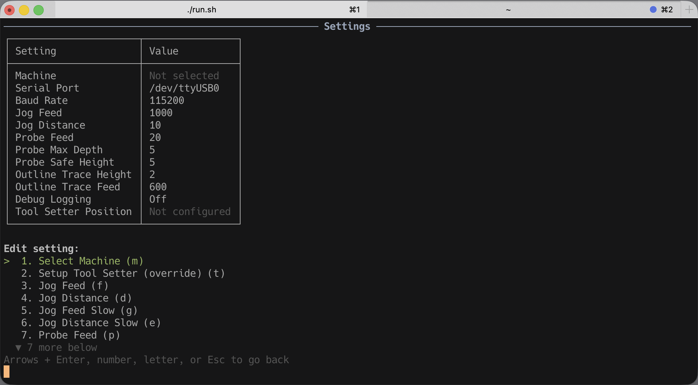
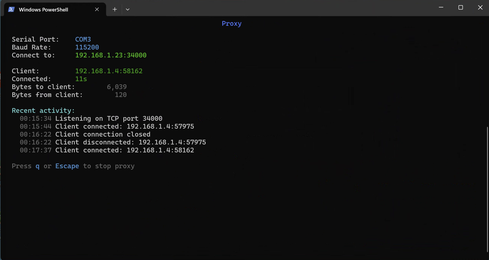
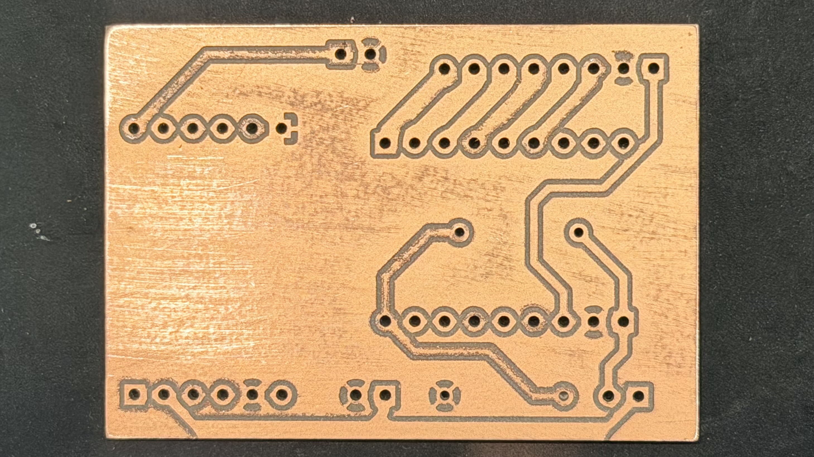

#  coppercli

A terminal-based tool for PCB milling with GRBL CNC machines. Probe-based auto-leveling, automatic tool changes (M6), macros, session recovery, real-time visualization. Cross-platform. Originally based on [OpenCNCPilot](https://github.com/martin2250/OpenCNCPilot).

| Probing | Milling |
|:-------:|:-------:|
|  |  |

## Install

[](https://github.com/thomergil/coppercli/releases/latest)
[](https://github.com/thomergil/homebrew-coppercli)
[](https://github.com/thomergil/coppercli/releases/latest)

| Platform | Install |
|----------|---------|
| **Windows** | Download and run installer from [Releases](https://github.com/thomergil/coppercli/releases/latest) |
| **macOS** | `brew tap thomergil/coppercli && brew install coppercli` |
| **Linux** | Download tarball from [Releases](https://github.com/thomergil/coppercli/releases/latest), extract, run `./coppercli` |
| **From source** | Clone repo, then `./run.sh` (macOS/Linux) or `run.bat` (Windows) |

Requires [.NET 8 SDK](https://dotnet.microsoft.com/download/dotnet/8.0) for running from source.

**Windows troubleshooting:** If you get `NETSDK1064: Package System.IO.Ports was not found`, run `dotnet restore` first.

## Screenshots

| Main Menu                                 | File Browser                                 | Jog                                      |
| ----------------------------------------- | -------------------------------------------- | ---------------------------------------- |
|  |  |  |

| Probe Setup | Probing | Milling |
|-------------|---------|---------|
|  |  |  |

| Settings | Proxy | Milled PCB |
|----------|-------|------------|
|  |  |  |

## Tutorial

For a complete end-to-end guide on milling PCBs, from KiCad export through G-code generation to probing and milling, see [Milling a PCB with auto-leveling using a Carbide 3D Nomad 3](https://github.com/thomergil/pcb-nomad3).

## Background

Based on [OpenCNCPilot](https://github.com/martin2250/OpenCNCPilot) by [Martin Pittermann](https://github.com/martin2250), an excellent CNC milling with height map interpolation. However, OpenCNCPilot is Windows-only, requires many finicky mouse clicks, and loses state on disconnect. coppercli is cross-platform, keyboard-driven, designed for minimum interaction, and recovers interrupted sessions. I used [Claude Code](https://claude.ai/claude-code) to rework the codebase.

## Features

- Cross-platform, auto-detects serial port and baud rate
- Keyboard-driven: single-key menu navigation, arrow/HJKL for jogging, Tab to cycle speeds
- Jog speed presets (Fast/Normal/Slow/Creep) with vim-style multipliers (e.g., `3L` = 3× right)
- Feed override during milling (`+`/`-`/`0` for ±10%/reset)
- Tool change (M6): auto-measures tool length with tool setter, or prompts re-probe without
- Built-in machine profiles
- Probe grid auto-leveling with configurable parameters (safe height, depth, feed rate, grid size)
- Real-time probing and milling displays with position grid visualization
- Outline traversal to check clearance before probing
- Save/load probe grids
- Macros for multi-step workflows with file placeholders
- Home, unlock, soft reset, XY/Z/XYZ homing, single Z probe
- Quick positioning: X0Y0, Z0, Z+6mm, Z+1mm, center of G-code bounds
- Built-in file browser with optional search/filter
- Session recovery: interrupted probing resumes, remembers last file, restores home points

## Macros

Automate multi-step workflows with `.cmacro` files:

```
# pcb-job.cmacro
home
load [back_file:file]
prompt "Jog to PCB origin"
jog
prompt "Attach probe clip"
probe z
zero xyz
probe grid
prompt "Remove probe clip, close door"
mill
```

Run from menu (Main Menu → Macro) or command line:

```bash
coppercli --macro pcb-job.cmacro --back_file ~/boards/back.ngc
```

Placeholders like `[back_file:file]` prompt a file browser at runtime, or accept values via `--name path` on the command line. See [docs/macros.md](docs/macros.md) for the full command reference.

## Proxy Mode

coppercli can act as a serial-to-TCP bridge, allowing remote GRBL clients to connect to your CNC machine over the network.

Select "Proxy" from the main menu, or start it from the command line:

```bash
# Start proxy with interactive TUI display
coppercli --proxy

# Override the default TCP port (34000)
coppercli --proxy --port 35000

# Run without TUI (for services/scripts)
coppercli --proxy --headless
```

When the proxy starts, it displays the IP addresses clients can use to connect. A client should connect to the displayed IP and port (default: 34000) using TCP. Only one client can connect at a time. Clients that disconnect ungracefully are detected via heartbeat timeout (30 seconds).

**Warning:** Do not run the client (coppercli connecting to proxy) on a laptop or device that may suspend/sleep. If the client suspends during milling, the network connection is lost, and the machine may be left in an unknown state. The proxy attempts to stop the machine on disconnect (feed hold + soft reset), but this is not guaranteed. Always run the client on a device connected to power with sleep disabled.

## Command-Line Arguments

| Argument | Short | Description |
|----------|-------|-------------|
| `--macro <file>` | `-m` | Run a macro file, auto-connect, and exit |
| `--<name> <path>` | | Provide value for macro placeholder (e.g., `--back_file ~/back.ngc`) |
| `--proxy` | `-p` | Start directly in proxy mode using saved serial settings |
| `--port <number>` | | Override TCP port for proxy mode (default: 34000) |
| `--headless` | `-H` | Run proxy without TUI (for services/background) |
| `--debug` | `-d` | Enable debug logging to `coppercli.log` |

## Warning

**This software is EXTREMELY EXPERIMENTAL and may damage your CNC machine and drill bits. Use at your own risk. Stay nearby. Keep your hand on the emergency stop.**

## License

MIT License - see [LICENSE](LICENSE)

## Acknowledgments

- [OpenCNCPilot](https://github.com/martin2250/OpenCNCPilot) by [Martin Pittermann](https://github.com/martin2250) - the foundation this project is built on
- [Spectre.Console](https://spectreconsole.net/) - console UI library
- [Claude Code](https://claude.ai/claude-code)
