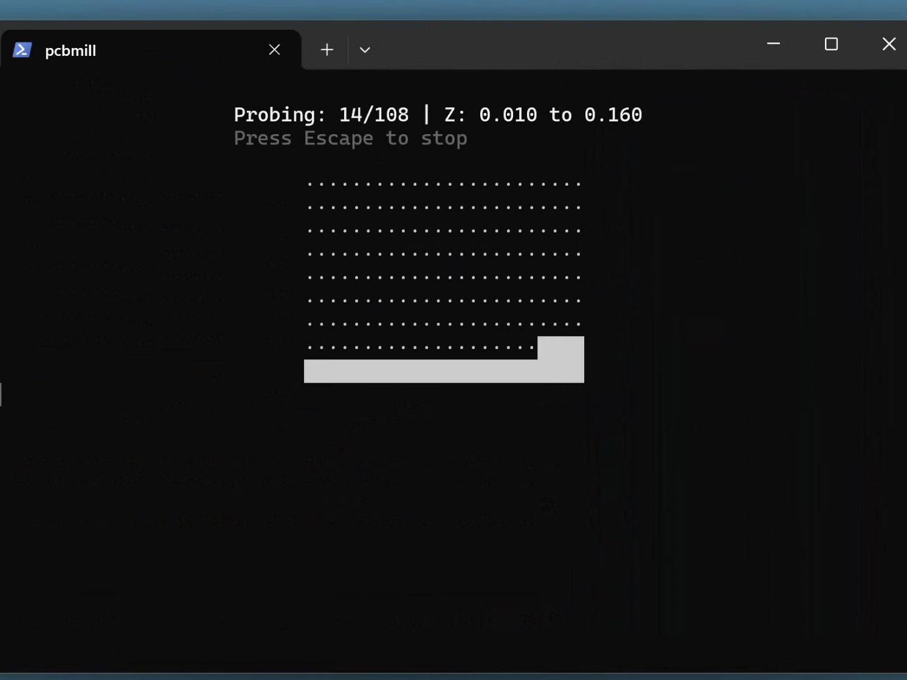

# coppercli

A platform-agnostic CLI tool for PCB milling with GRBL CNC machines, featuring auto-leveling via probe grids.


## Screenshots

| Main Menu | Move/Jog | Probe Menu | Milling |
|-----------|----------|------------|---------|
|  |  |  |  |

| Probing in Progress | Milled PCB |
|---------------------|------------|
|  |  |

## Background

This project is based on [OpenCNCPilot](https://github.com/martin2250/OpenCNCPilot) by [martin2250](https://github.com/martin2250), which is an excellent tool for CNC machine control and PCB auto-leveling. OpenCNCPilot has solid core functionality for G-code parsing, height map interpolation, and GRBL communication.

However, OpenCNCPilot has some limitations:

- **Windows-only**: Built with WPF, it only runs on Windows
- **GUI-heavy workflow**: The interface requires a lot of mouse clicking and navigating through dialogs, which can be cumbersome when you're standing at a CNC machine with greasy hands
- **No session persistence**: If you disconnect or the program crashes mid-probe, you lose your progress and have to start over

coppercli addresses these issues by providing a keyboard-driven CLI that runs on Linux, macOS, and Windows, with robust session recovery.

## A Note on Development

C#/.NET is by no means my language of choice, but I wanted to leverage the excellent core functionality in OpenCNCPilot rather than rewrite G-code parsing and height map interpolation from scratch. I worked with [Claude Code](https://claude.ai/claude-code) to rework the codebase into this CLI version.

## Features

### Platform Agnostic
- Runs on Linux, macOS, and Windows
- .NET 8 runtime (cross-platform)
- Serial and Ethernet connections supported

### Keyboard-Driven Interface
- Single-key navigation throughout
- Arrow keys for jogging, Tab to cycle speeds
- Number keys and mnemonics for menu selection
- Built-in file browser for G-code and probe grid files
- No mouse required

### Probing Features
- **Probe grid auto-leveling**: Compensates for PCB surface irregularities
- **Outline traversal**: Before probing, traverse the outer boundary of the probe area to check for collisions or clearance issues
- **Configurable probe parameters**: Safe height, max depth, feed rate, grid size
- **Save/load probe grids**: Reuse probe data across sessions (.pgrid files)

### Session Persistence

- **Continue where you left off**: Interrupted probing sessions are auto-saved and can be resumed
- **Remembers your last file**: Offers to reload the last G-code file on startup
- **Trusts stored work zero**: Option to accept GRBL's stored work coordinate system from a previous session

### Machine Control

- Real-time position display
- Multiple jog speed presets (Tab to cycle: Fast/Normal/Slow/Creep)
- Home, unlock, and soft reset commands
- Set work zero (all axes or Z-only)
- Quick positioning (go to X0Y0, Z0, Z+6mm, Z+1mm)
- Single Z probe (find Z height at current XY position)
- Move to center of loaded G-code file

### G-Code Handling
- Load and preview G-code files
- View file bounds and estimated run time
- Apply height map compensation
- Run with real-time progress display

## Installation

### Prerequisites
- [.NET 8 SDK](https://dotnet.microsoft.com/download/dotnet/8.0)

### Build and Run
```bash
git clone git@github.com:thomergil/coppercli.git
cd coppercli

# macOS/Linux
./run.sh

# Windows (double-click run.bat or from command line)
run.bat
```

The run scripts auto-detect your dotnet installation (Homebrew, MacPorts, system packages, etc.) and provide installation instructions if dotnet is not found.

## Usage

```bash
./run.sh        # macOS/Linux
run.bat         # Windows
```

On first run, coppercli will show an experimental warning (can be silenced) and guide you through:

1. **Connect** to your GRBL machine (serial or ethernet)
2. **Load** a G-code file
3. **Set work zero** using the Move menu (jog to your PCB corner, press 0)
4. **Probe** the surface (creates a height map)
5. **Apply** the probe data to the G-code
6. **Run** the compensated G-code

### Typical Workflow

```
1. Connect to machine
2. Home if needed
3. Load G-code file
4. Jog to PCB corner, set work zero (0 key)
5. Enter Probe menu
6. Traverse outline to verify clearance
7. Start probing
8. Apply probe data to G-code
9. Mill
```

## Configuration

Settings are stored in `settings.json` in the working directory:

- **Connection**: Serial port, baud rate, ethernet IP/port
- **Jogging**: Feed rates and distances for normal/slow modes
- **Probing**: Safe height, max depth, feed rate, grid size
- **Outline traversal**: Height and feed rate for boundary check

## File Formats

- **G-code**: `.nc`, `.gcode`, `.ngc`, `.gc`, `.tap`, `.cnc`
- **Probe grids**: `.pgrid` (XML format, compatible with OpenCNCPilot's `.hmap`)

## Warning

**This software is EXTREMELY EXPERIMENTAL and may damage your CNC machine. Use at your own risk.**

Always:
- Start with the spindle off when testing
- Use the outline traversal feature to check clearance before probing
- Keep your hand on the emergency stop
- Verify probe data looks reasonable before running G-code

## License

MIT License - see [LICENSE](LICENSE)

## Acknowledgments

- [OpenCNCPilot](https://github.com/martin2250/OpenCNCPilot) by [martin2250](https://github.com/martin2250) - the foundation this project is built on
- [Spectre.Console](https://spectreconsole.net/) - beautiful console UI library
- [Claude Code](https://claude.ai/claude-code) - AI pair programming assistant
