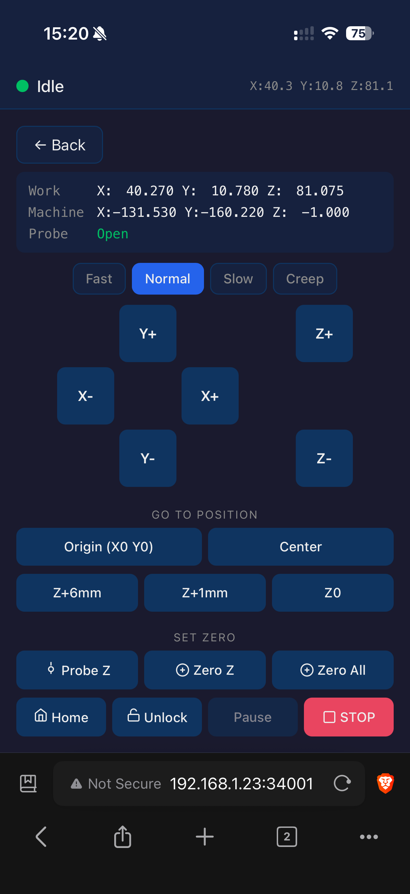
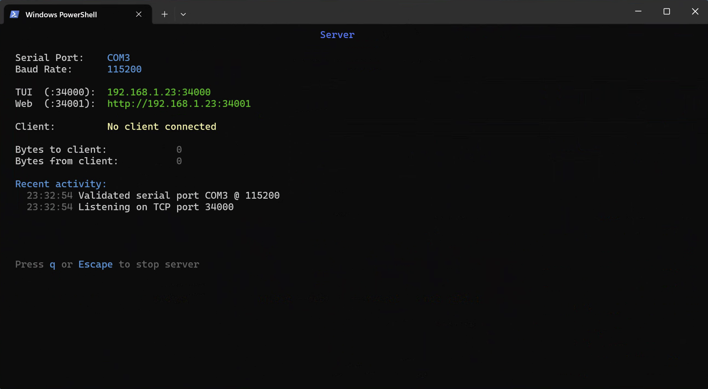
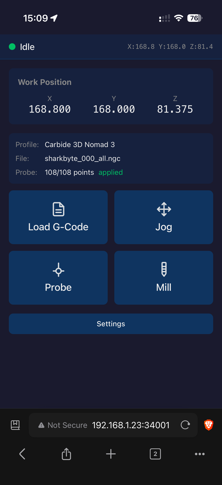
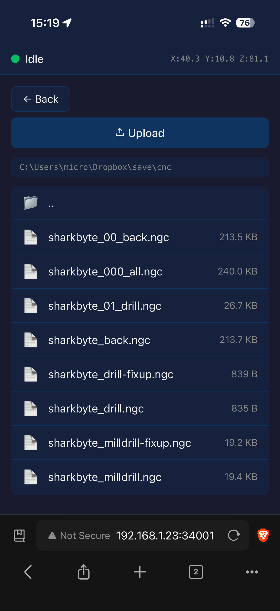
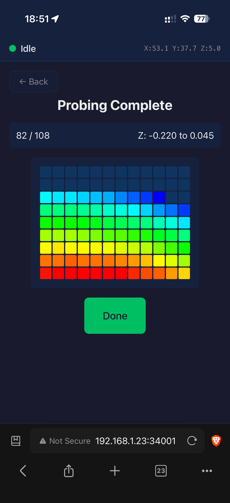
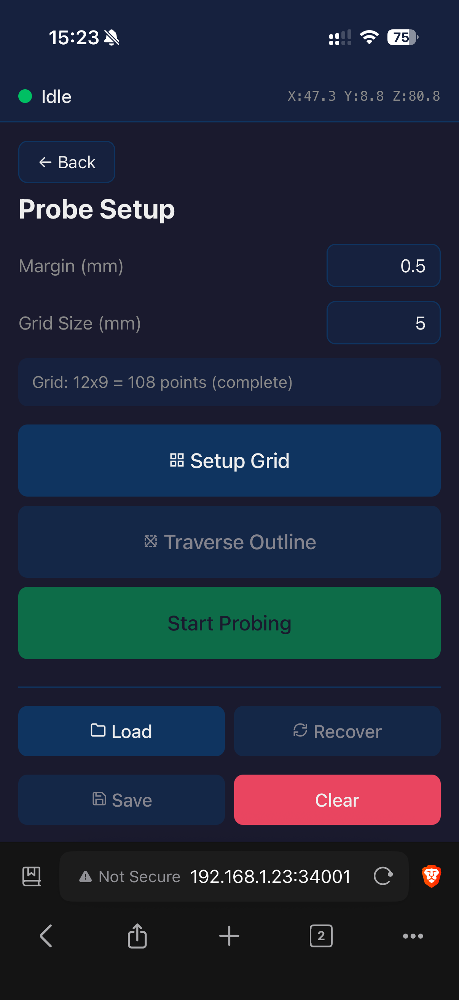
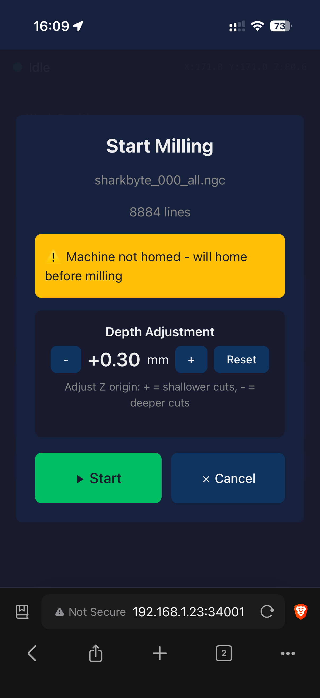
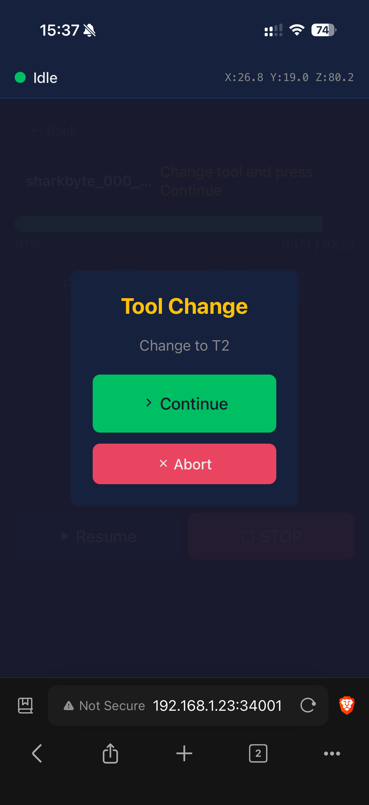
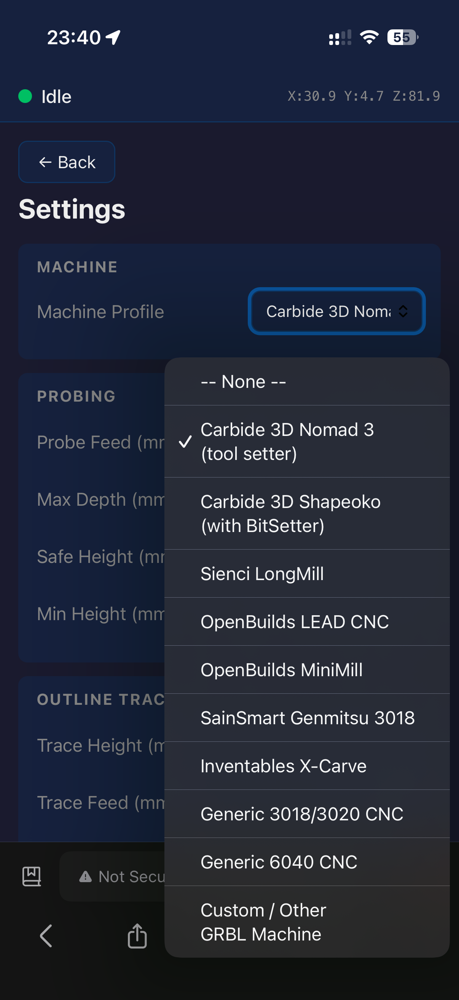

#  coppercli

Cross-platform (Mac, Linux, Windows, and web) tool for PCB milling on GRBL machines with probe-based auto-leveling, tool changes, real-time visualization, depth-adjusted remills, session recovery, and a safety-first approach.

* Works **directly over USB/Serial** as a keyboard-driven terminal app on Mac, Linux, and Windows
* Can work as a **USB/Serial proxy**, allowing remote control over a local network
* Can work as **http server**, allowing remote control from a **browser** (desktop or mobile)

Originally based on [OpenCNCPilot](https://github.com/martin2250/OpenCNCPilot), which is Windows-only.

| Probing | Milling | Jogging (phone) |
|:-------:|:-------:|:-------:|
|  |  ||

## Install

[](https://github.com/thomergil/coppercli/releases/latest)
[](https://github.com/thomergil/homebrew-coppercli)
[](https://github.com/thomergil/coppercli/releases/latest)

| Platform | Install |
|----------|---------|
| **Windows** | Download and run installer from [Releases](https://github.com/thomergil/coppercli/releases/latest) |
| **macOS** | `brew tap thomergil/coppercli && brew install coppercli` |
| **Linux** | Download tarball from [Releases](https://github.com/thomergil/coppercli/releases/latest), extract, run `./coppercli` |
| **From source** | Clone repo, then `./run.sh` (macOS/Linux) or `run.bat` (Windows) |

Requires [.NET 8 SDK](https://dotnet.microsoft.com/download/dotnet/8.0) to run from source.

**GRBL version:** As per the [OpenCNCPilot documentation](https://github.com/martin2250/OpenCNCPilot), use GRBL 1.1f. Later versions may work, but are untested. Earlier versions (0.8, 0.9, 1.0) will **not** work. There are no workarounds, so you need to update your controller firmware.

## Terminal screenshots

| Main Menu                                 | File Browser                                 | Jog                                      |
| ----------------------------------------- | -------------------------------------------- | ---------------------------------------- |
|  |  |  |

| Probe Setup | Probing | Milling |
|-------------|---------|---------|
|  |  |  |

| Settings | Proxy | Milled PCB |
|----------|-------|------------|
|  |  |  |

## Web screenshots
|                 Main Menu                 |                 File Browser                 |                   Jog                    |
| :---------------------------------------: | :------------------------------------------: | :--------------------------------------: |
|  |  |  |

|                   Probe Setup                   |                   Probing                    |                   Milling                    |
| :---------------------------------------------: | :------------------------------------------: | :------------------------------------------: |
|  |  |  |

|                   Height  change                   |                   Tool change                   | Settings |
| :---------------------------------------------: | :------------------------------------------: | :-----: |
|  |  |  |


## Tutorial

For a complete end-to-end guide on milling PCBs, from KiCad export through G-code generation to probing and milling, see [Milling a PCB with auto-leveling using a Carbide 3D Nomad 3](https://thomer.com/pcb-nomad3).

## Background

Based on [OpenCNCPilot](https://github.com/martin2250/OpenCNCPilot) by [Martin Pittermann](https://github.com/martin2250), an excellent CNC milling with height map interpolation. However, OpenCNCPilot is Windows-only, requires many finicky mouse clicks, and loses state on disconnect. coppercli is cross-platform, keyboard-driven, designed for minimal interaction, and can recover interrupted sessions. I used [Claude Code](https://claude.ai/claude-code) to rework the codebase.

## Features

- Cross-platform, auto-detects serial port and baud rate
- Proxy mode for network access; HTTP server for web access
- Keyboard-driven: single-key menu navigation, arrow/HJKL for jogging, Tab to cycle speeds
- Jog speed presets (fast/normal/slow/creep) with vim-style multipliers (e.g., `3k` = 3× up)
- Feed speed override during milling in 10% increments
- Depth adjustment for re-milling in ±0.02mm increments
- Tool change (M6): auto-measures tool length with tool setter, or prompts re-probe without
- Built-in machine profiles
- Probe grid auto-leveling with configurable margin and grid size
- Slow probe detection: pauses if a probe takes 20% longer than average to protect bad probes
- Real-time probing and milling displays with position grid visualization
- Outline traversal to check clearance before probing
- Save/load probe grids
- Macros for multi-step workflows with file placeholders
- Home, unlock, soft reset, XY/Z/XYZ homing, single Z probe
- Quick positioning: X0Y0, Z0, Z+6mm, Z+1mm, center of G-code bounds
- Built-in file browser with optional search/filter
- Safety-first: refuses suspect settings, requires homing, raises to safe height before moves
- Session recovery: interrupted probing resumes, remembers last file, restores home points

## Server Mode

Server mode runs both a TCP proxy and a web server, allowing remote access via either:

- **Port 34000**: Raw GRBL over TCP (for TUI clients using Network mode)
- **Port 34001**: HTTP/WebSocket (for browser-based control)

```bash
# Start server mode
coppercli --server

# Override ports
coppercli --server --proxy-port 35000 --web-port 8080
```

When started, the console displays the connection URLs. Only one client can connect at a time.

**Warning:** While coppercli employs tools to prevent sleep, be careful running clients on a laptop or device that may suspend/sleep. If the client suspends during milling, the network connection is lost, and the machine may be left in an unknown state. Always run the client on a device connected to power with sleep disabled. You should always stay close to your CNC machine when it is running.

## Macros

Automate multi-step workflows with `.cmacro` files:

```
# pcb-job.cmacro
home
load [back_file:file]
prompt "Jog to PCB origin"
jog
prompt "Attach probe clip"
probe z
zero xyz
probe grid
prompt "Remove probe clip, close door"
mill
```

Run from menu (Main Menu → Macro) or command line:

```bash
coppercli --macro pcb-job.cmacro --back_file ~/boards/back.ngc
```

Placeholders like `[back_file:file]` prompt a file browser at runtime, or accept values via `--name path` on the command line. See [docs/macros.md](docs/macros.md) for the full command reference.

### Windows Setup

On Windows, a one-time setup is required (run in Administrator PowerShell):

**Allow network access (firewall rules):**
```powershell
netsh advfirewall firewall add rule name="coppercli-proxy" dir=in action=allow protocol=tcp localport=34000
netsh advfirewall firewall add rule name="coppercli-web" dir=in action=allow protocol=tcp localport=34001
netsh http add urlacl url=http://+:34001/ user=Everyone
```

The URL reservation is required for the web server. Without it, you'll get "Access Denied" when starting. If you use custom ports, replace the port numbers accordingly.

## Command-Line Arguments

| Argument | Short | Description |
|----------|-------|-------------|
| `--macro <file>` | `-m` | Run a macro file, auto-connect, and exit |
| `--<name> <path>` | | Provide value for macro placeholder (e.g., `--back_file ~/back.ngc`) |
| `--server` | `-s` | Start server mode (proxy on 34000, web on 34001) |
| `--proxy-port <number>` | | Override TCP proxy port (default: 34000) |
| `--web-port <number>` | | Override web server port (default: 34001) |
| `--debug` | `-d` | Enable debug logging to `coppercli.log` |

## A note on Claude Code and code quality

This is a fork and an almost ground-up rewrite of [OpenCNCPilot](https://github.com/martin2250/OpenCNCPilot). I did much of this with Claude Code. As of the time of this writing (Feb, 2026), Claude Code quickly writes reasonable code. It does not maintain high code quality, write DRY code, or stick to clean coding patterns. I spent most of my time on this project pursuing clean code. All that said, this code is reasonably well tested but does not meet the code quality standards I'd hold myself to if writing it entirely by hand.

That brings me, semi-related, to:

## Warning

**This software is EXTREMELY EXPERIMENTAL and may damage your CNC machine and drill bits. Use at your own risk. Stay nearby. Keep your hand on the emergency stop.**

## License

MIT License - see [LICENSE](LICENSE)

## Acknowledgments

- [OpenCNCPilot](https://github.com/martin2250/OpenCNCPilot) by [Martin Pittermann](https://github.com/martin2250) - the foundation this project is built on
- [Spectre.Console](https://spectreconsole.net/) - console UI library
- [Claude Code](https://claude.ai/claude-code)
