#  coppercli

coppercli mills PCBs on GRBL machines: probe-based auto-leveling, tool changes, real-time
visualization, depth-adjusted remills, and session recovery. It runs on macOS, Linux, and
Windows.

Three ways to run it:

* As a keyboard-driven terminal app, **over USB/serial**
* As a **USB/serial proxy**, for control from another computer on a local network
* As an **HTTP server**, for control from a browser on a desktop or phone

Originally based on [OpenCNCPilot](https://github.com/martin2250/OpenCNCPilot), which is Windows-only.

| Probing | Milling | Jogging (phone) |
|:-------:|:-------:|:-------:|
| 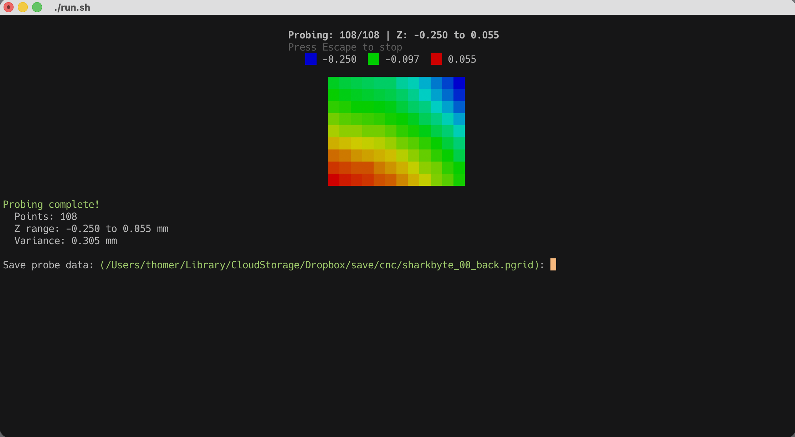 | 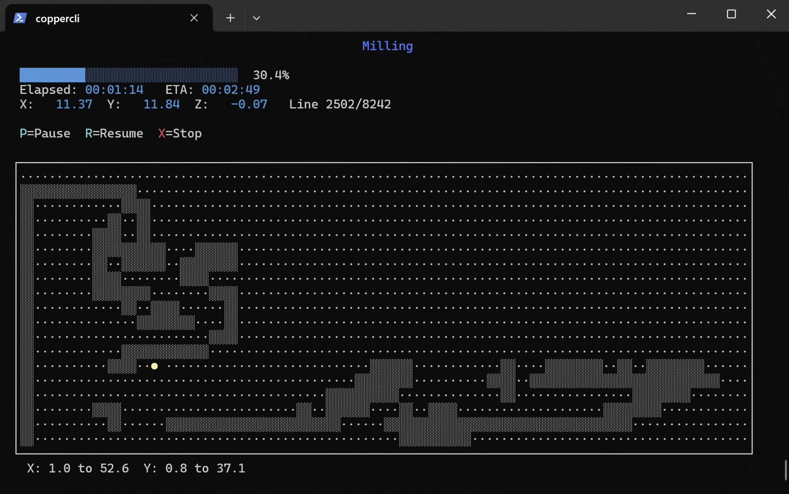 |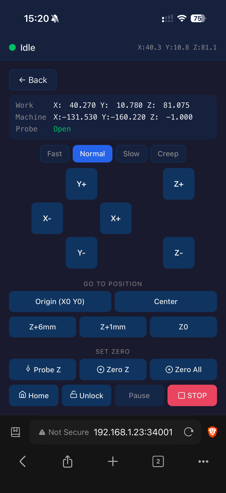|

## Install

[](https://github.com/thomergil/coppercli/releases/latest)
[](https://github.com/thomergil/homebrew-coppercli)
[](https://github.com/thomergil/coppercli/releases/latest)

| Platform | Install |
|----------|---------|
| **Windows** | Download and run installer from [Releases](https://github.com/thomergil/coppercli/releases/latest) |
| **macOS** | `brew tap thomergil/coppercli && brew install coppercli` |
| **Linux** | Download tarball from [Releases](https://github.com/thomergil/coppercli/releases/latest), extract, run `./coppercli` |
| **From source** | Clone repo, then `./run.sh` (macOS/Linux) or `run.bat` (Windows) |

Running from source requires the [.NET 8 SDK](https://dotnet.microsoft.com/download/dotnet/8.0).

**GRBL version:** Use GRBL 1.1f, as the [OpenCNCPilot documentation](https://github.com/martin2250/OpenCNCPilot) recommends. Later versions may work but are untested. Versions 0.8, 0.9 and 1.0 do not work, and there is no workaround: update your controller firmware.

## Terminal screenshots

| Main Menu                                 | File Browser                                 | Jog                                      |
| ----------------------------------------- | -------------------------------------------- | ---------------------------------------- |
| 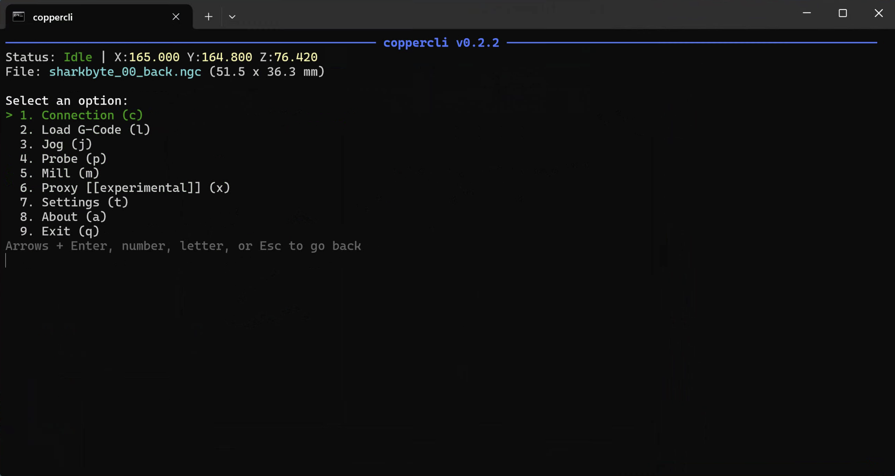 | 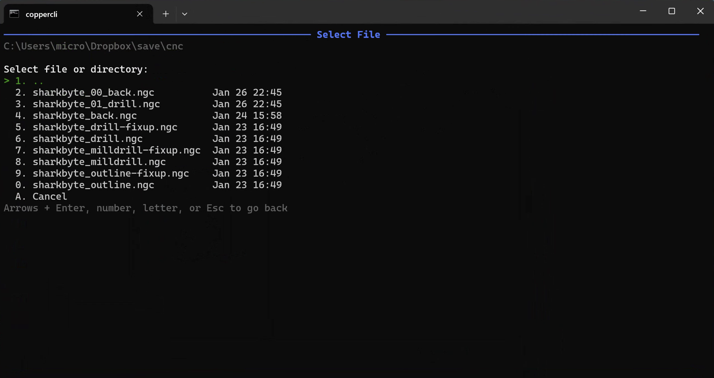 | 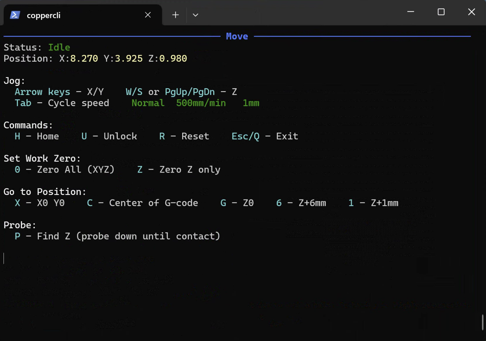 |

| Probe Setup | Probing | Milling |
|-------------|---------|---------|
| 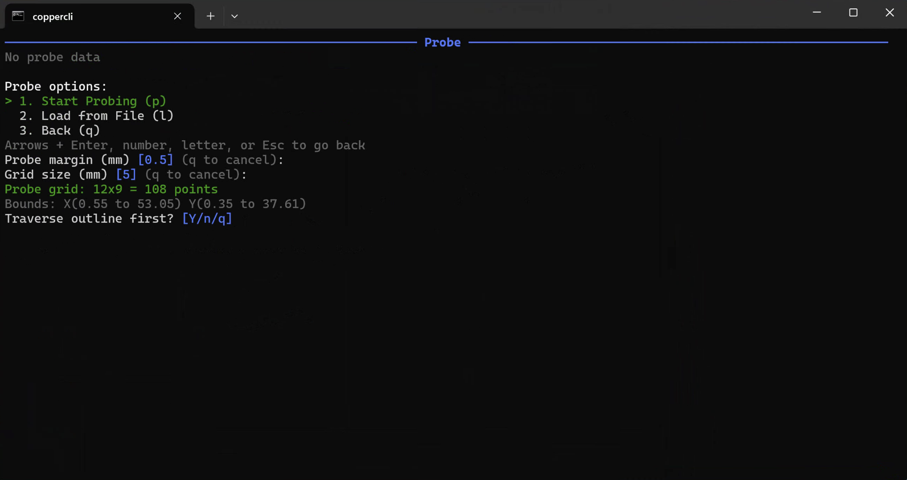 |  |  |

| Settings | Proxy | Milled PCB |
|----------|-------|------------|
| 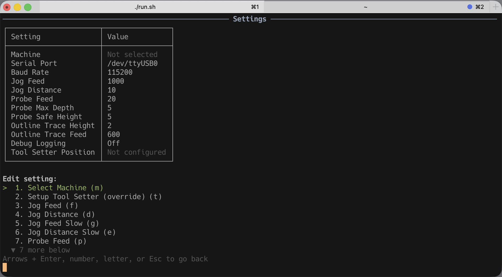 | 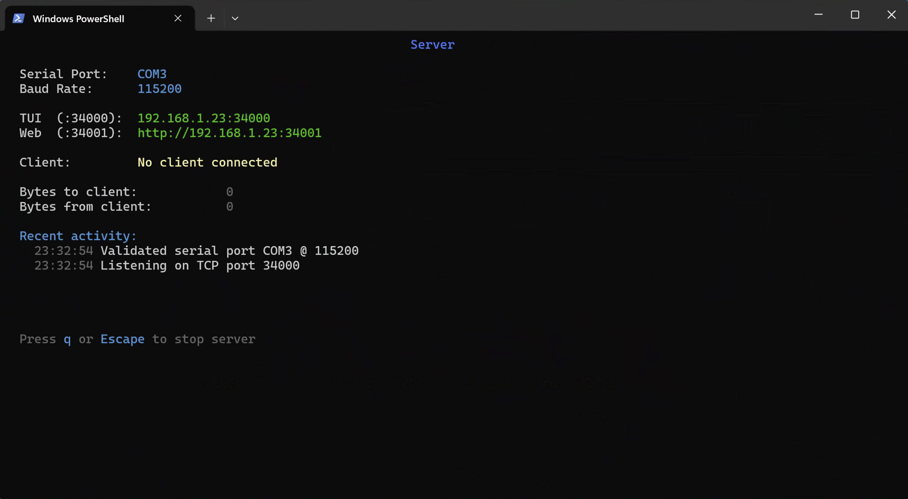 | 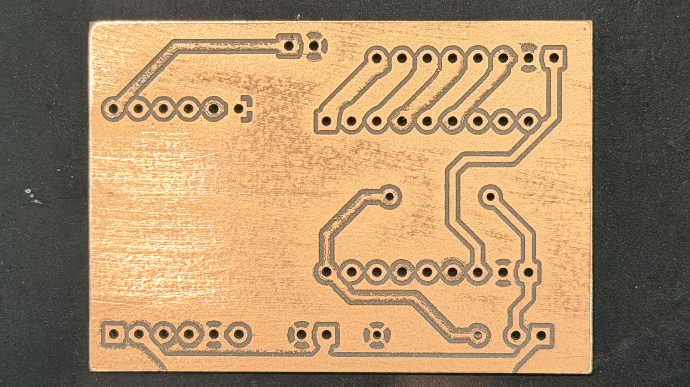 |

## Web screenshots
|                 Main Menu                 |                 File Browser                 |                   Jog                    |
| :---------------------------------------: | :------------------------------------------: | :--------------------------------------: |
| 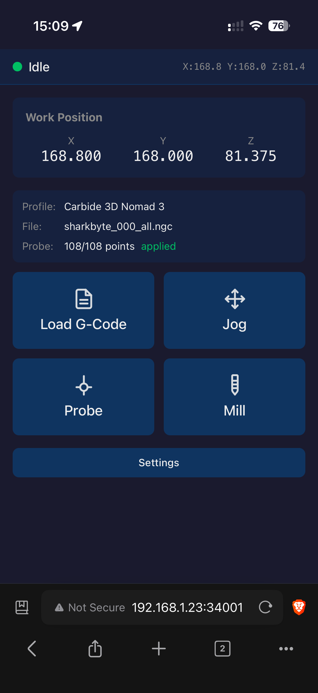 | 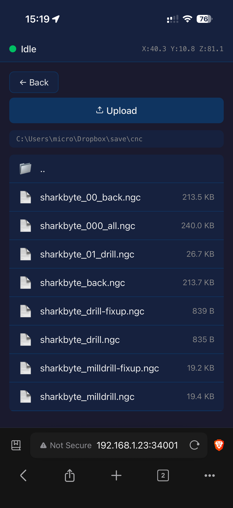 |  |

|                   Probe Setup                   |                   Probing                    |                   Milling                    |
| :---------------------------------------------: | :------------------------------------------: | :------------------------------------------: |
|  | 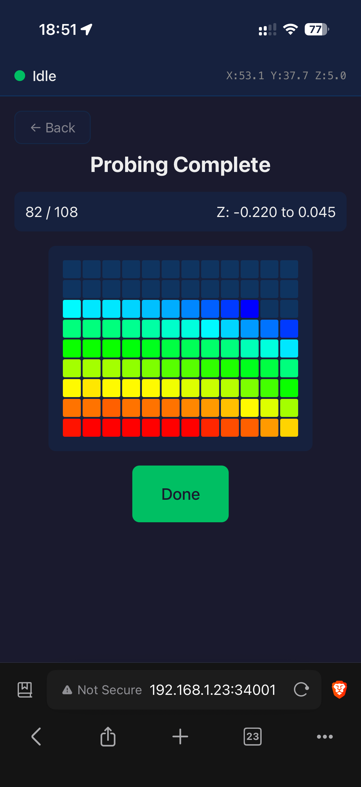 | 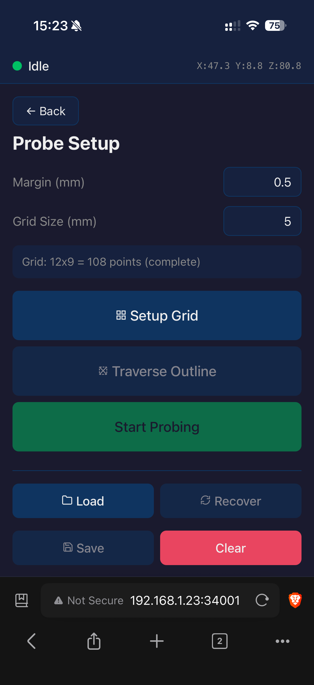 |

|                   Height  change                   |                   Tool change                   | Settings |
| :---------------------------------------------: | :------------------------------------------: | :-----: |
| 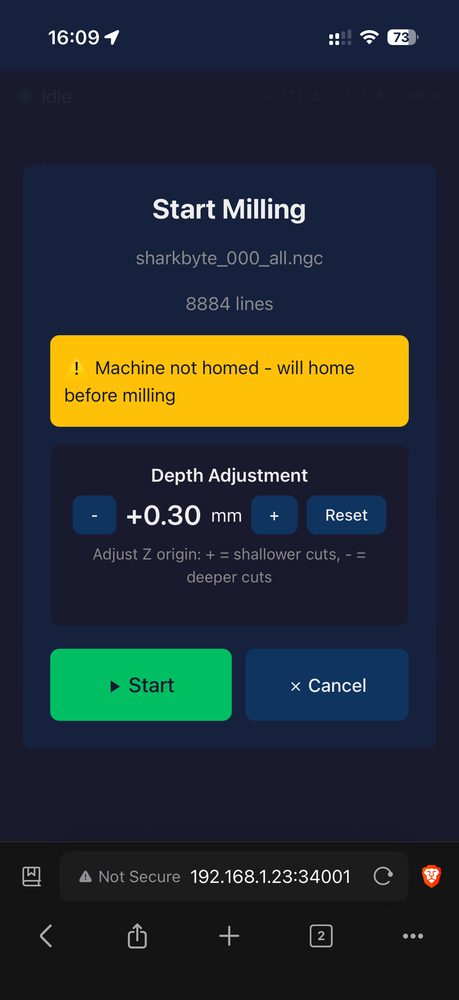 | 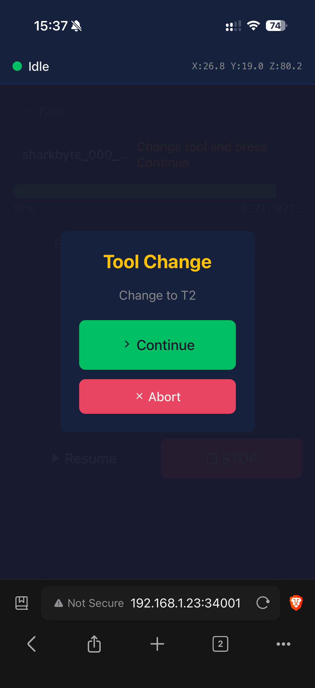 | 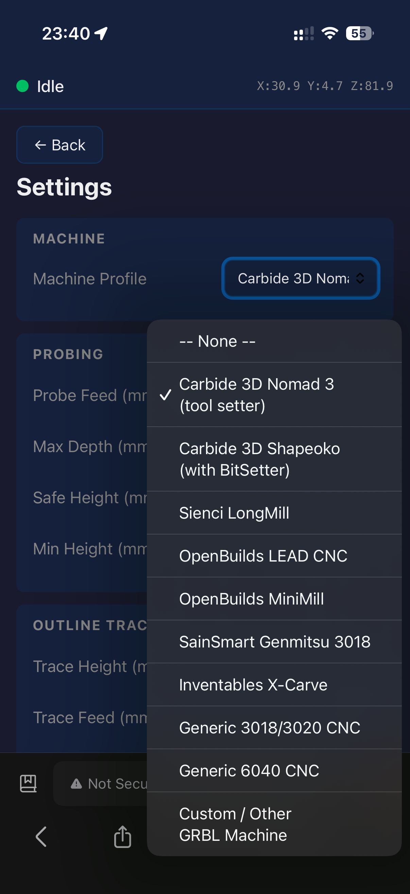 |


## Tutorial

For an end-to-end guide to milling PCBs, from KiCad export through G-code generation to probing and milling, see [Milling a PCB with auto-leveling using a Carbide 3D Nomad 3](https://thomer.com/pcb-nomad3).

## Background

coppercli is a fork of [OpenCNCPilot](https://github.com/martin2250/OpenCNCPilot) by [Martin Pittermann](https://github.com/martin2250), a CNC milling program with height map interpolation. OpenCNCPilot runs on Windows only, takes many mouse clicks, and loses its state when the connection drops. coppercli is cross-platform, keyboard-driven, needs little interaction during a job, and can recover an interrupted session. I used [Claude Code](https://claude.ai/claude-code) to rework the codebase.

## Features

- Cross-platform; auto-detects serial port and baud rate
- Proxy mode for network access; HTTP server for browser access
- Keyboard-driven: single-key menu navigation, arrows or WASD to jog X and Y, Q and Z to
  jog the tool up and down, Tab to cycle speeds
- Jog speed presets (fast, normal, slow, creep), with a digit prefix as multiplier, so `3w`
  jogs three steps in +Y
- Feed speed override during milling, in 10% increments
- Depth adjustment for re-milling, in ±0.02mm increments
- Tool change (M6): measures tool length with a tool setter, or prompts for a re-probe if
  there is no setter
- Built-in machine profiles
- Probe grid auto-leveling with configurable margin and grid size
- Bad probe detection: pauses when a measured height is too far from the points already
  measured around it, which catches a reading taken on debris or one that pushed through
  the surface
- Probing and milling displays with position grid visualization
- Outline traversal to check clearance before probing
- Save and load probe grids
- Macros for multi-step workflows, with file placeholders
- Home, unlock, soft reset, XY/Z/XYZ homing, single Z probe
- Quick positioning: X0Y0, Z0, Z+6mm, Z+1mm, center of G-code bounds
- Built-in file browser with optional search/filter
- Refuses out-of-range settings, requires homing, and raises to safe height before moves
- Session recovery: interrupted probing resumes, the last file is remembered, home points
  are restored

## Server Mode

Server mode runs a TCP proxy and a web server at the same time:

- **Port 34000**: raw GRBL over TCP, for TUI clients in Network mode
- **Port 34001**: HTTP/WebSocket, for browser control

Open the **web UI** by typing the address printed at startup, such as
`http://192.168.1.5:34001`, into any browser on the same network. There is no password.

Use the numeric address, or a plain machine name such as `mill` or `mill.local`. A dotted
domain name such as `mill.lan`, `mill.home.arpa`, or anything from your router's search
domain is refused. Accepting those would let a remote site point a domain of its own at
your machine and drive it through your browser.

Three kinds of request are refused:

- A request whose source address is not on a private network and does not share a subnet
  with this machine. Plain port-forwarding therefore does not expose the mill.
- A request whose `Origin` or `Sec-Fetch-Site` header says it came from a page on another
  site.
- A request for a domain name that re-resolves to your machine's address (DNS rebinding).

A cross-site `GET` - an `` or `<script>` on someone else's page pointed at this port -
carries nothing that identifies where it came from, so it cannot be told apart from your own
navigation and is admitted. No `GET` moves the machine, starts a job, or writes a file.

> **This does not protect against other people on your own network.** Anyone on it can
> drive the machine, and port 34000 has no access check at all. Only run either on a
> network you trust.
>
> It also does not help if you publish the port through something that terminates locally,
> such as an `ssh -R` tunnel, `ngrok`, or a reverse proxy. The request then arrives from
> this machine itself. Do not expose either port that way.

```bash
# Start server mode
coppercli --server

# Override ports
coppercli --server --proxy-port 35000 --web-port 8080
```

At startup the console prints the connection URLs. Drive the machine from one page.
Nothing enforces this: a second browser gets a take-over prompt and still works if you
decline it, and coppercli does not detect a second tab of the same browser.

**Warning:** coppercli tries to keep the client awake, but a laptop or phone can still
suspend. If the client suspends during milling, the network connection is lost and the
machine may be left in an unknown state. Run the client on a device connected to power
with sleep disabled, and stay next to the machine while it runs.

## Macros

`.cmacro` files run multi-step workflows:

```
# pcb-job.cmacro
home
load [back_file:file]
prompt "Jog to PCB origin"
jog
prompt "Attach probe clip"
probe z
zero xyz
probe grid
prompt "Remove probe clip, close door"
mill
```

Run from the menu (Main Menu → Macro) or the command line:

```bash
coppercli --macro pcb-job.cmacro --back_file ~/boards/back.ngc
```

A placeholder such as `[back_file:file]` opens a file browser at runtime, or takes a value
from `--name path` on the command line. See [docs/macros.md](docs/macros.md) for the full
command reference.

### Windows Setup

Windows needs a one-time setup, run in an Administrator PowerShell.

**Allow network access (firewall rules):**
```powershell
netsh advfirewall firewall add rule name="coppercli-proxy" dir=in action=allow protocol=tcp localport=34000
netsh advfirewall firewall add rule name="coppercli-web" dir=in action=allow protocol=tcp localport=34001
netsh http add urlacl url=http://+:34001/ user=Everyone
```

The web server needs the URL reservation; without it, startup fails with "Access Denied".
If you use custom ports, replace the port numbers accordingly.

## Command-Line Arguments

| Argument | Short | Description |
|----------|-------|-------------|
| `--macro <file>` | `-m` | Run a macro file, auto-connect, and exit |
| `--<name> <path>` | | Provide value for macro placeholder (e.g., `--back_file ~/back.ngc`) |
| `--server` | `-s` | Start server mode (proxy on 34000, web on 34001) |
| `--proxy-port <number>` | | Override TCP proxy port (default: 34000) |
| `--web-port <number>` | | Override web server port (default: 34001) |
| `--port <number>` | | Older name for `--web-port` |
| `--debug` | `-d` | Enable debug logging to `coppercli.log` |

## A note on Claude Code and code quality

This is a fork and an almost ground-up rewrite of [OpenCNCPilot](https://github.com/martin2250/OpenCNCPilot), done mostly with Claude Code. As of August 2026, Claude Code running Claude Opus 5 writes reasonable code quickly. It does not keep the code DRY or stick to clean patterns, and most of my time on this project went into cleaning that up. The code is reasonably well tested, but it does not meet the standard I would hold myself to writing it by hand.

## Warning

**This software is experimental and may damage your CNC machine and drill bits. Use at your own risk. Stay nearby. Keep your hand on the emergency stop.**

## License

MIT License - see [LICENSE](LICENSE)

## Acknowledgments

- [OpenCNCPilot](https://github.com/martin2250/OpenCNCPilot) by [Martin Pittermann](https://github.com/martin2250) - the project coppercli is based on
- [Spectre.Console](https://spectreconsole.net/) - console UI library
- [Claude Code](https://claude.ai/claude-code)
